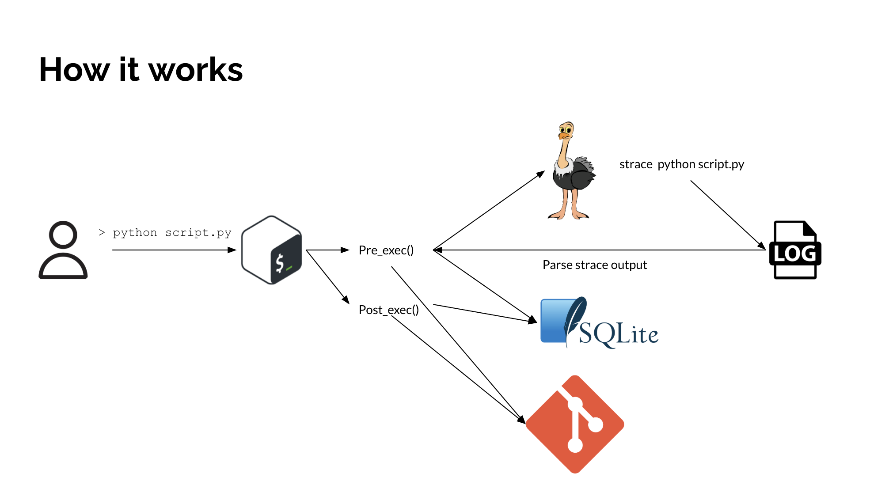

# Scimon

[](LICENSE)
[](https://github.com/Jerr-z/scimon/issues)
[](https://github.com/Jerr-z/scimon/stargazers)

> A scientific reproducibility tool supporting evolving experimental workflows

## Table of Contents

- [Scimon](#scimon)
  - [Table of Contents](#table-of-contents)
  - [Overview](#overview)
  - [Project Architecture](#project-architecture)
    - [Key Components](#key-components)
    - [Data Flow](#data-flow)
  - [Installation](#installation)
    - [Dependencies](#dependencies)
  - [Usage](#usage)
    - [Running the source code](#running-the-source-code)
  - [Logic Overview](#logic-overview)
    - [Bash Hooks](#bash-hooks)
      - [Pre-exec/Post-exec Hook:](#pre-execpost-exec-hook)
      - [Git Checking/commiting:](#git-checkingcommiting)
      - [Strace Parsing](#strace-parsing)
      - [Database Operations](#database-operations)
    - [Python CLI](#python-cli)
  - [Contributing](#contributing)
  - [License](#license)

## Overview

This tool aims to passively track the user's interactions with the computing environment through bash, and generate Makefiles that support reproducing any given version of any intermediate or result files produced in the experiment.

## Project Architecture

### Key Components

- **Bash**: Our way to track user actions passively, all commands being run in an interactive bash shell will be intercepted and run with strace instead to capture relevant system calls.
- **Git**: We are utilizing git's powerful version control abilities to keep track of file states. The commit hash also serves as a great unique identifier for storing system calls, commands and showing file changes.
- **SQLite3**: The system calls and related data are then parsed and stored into the database.
- **Python CLI**: Various functionalities are available through the CLI written in python.

### Data Flow




## Installation

### Dependencies
- SQLite3
- Python >= 3.9
- Strace
- Git
- Bash

```bash
# Install the CLI
pip install scimon
```

Then copy the contents of `commandhook.sh` into `~/.bashrc`, and restart the bash session for the hooks to take effect.

## Usage

```bash
# Adds a directory for monitoring
scimon add [dir]

# Reproduce a given file with optionally a specified commit hash, if no commit hash is specified then the latest version will be reproduced
scimon reproduce [file] --git-hash=abc123

# Outputs a provenance graph for the given file
scimon visualize [file] --git-hash=abc123
```

### Running the source code

I would highly recommend using `uv` to manage the dependencies of this project. Conda works? as an alternative.

## Logic Overview

### Bash Hooks

#### Pre-exec/Post-exec Hook: 
  
The hooks that fire before and after each command are implemented with bash's debug trap and `PROMPT_COMMAND` respectively.

The debug trap will fire before each bash command is executed, this is achieved through `trap [your-command] DEBUG`.

`PROMPT_COMMAND` will fire before each user prompt shows up in bash, this means that whenever a command finishes executing we can embed our own logic into a bash function and run it.

The code snippet below enable the hooks whenever an interaction bash session starts:
```bash
_init_hook() {
  PROMPT_COMMAND='_post_command_git_check'
  trap '_pre_command_git_check' DEBUG
}

PROMPT_COMMAND='_init_hook'
```

#### Git Checking/commiting: 

For every command that the user enters into bash, we will perform 2 checks through git, they happen everytime:
  - Before the execution of the command and commit if there are any changes in the monitored repository
  - After the execution of the command and commit if there are any changes to the monitored repository

Taking these snapshots allow us to determine commands that are producing side effects, which are the ones worth recording in our case.
  

#### Strace Parsing

In the function `_pre_command_git_check` (I really should rename this already), you can see that we are actually parsing the command and executing it with `strace` instead. This allows us to have a list of the system calls being used to execute the command which is stored in `~/.scimon/strace.log`. After the strace command stops running, we terminate the whole execution early so the original command doesn't get executed again!

Finally, we parse the output log with `_parse_strace`, and store relevant system calls in the proper tables

#### Database Operations

Currently we have 5 tables in the SQL database:
- `commands`: Stores all commands that has a side effect, associated with the commit id before and after the command.
- `executed_files`: Stores all system calls of the `execve` flavour (see details in `commandhook.sh: _parse_strace`).
- `file_changes`: Stores a list of file changes associated with the commit id (Most likely not needed, I created this in the very early stage of the project and haven't found a need for it yet).
- `opened_files`: Stores all system calls of the `openat` flavour, tracks file reads/writes.
- `processes`: Stores system calls of the `clone` flavour, not super useful at the moment but good to have.

### Python CLI

- `scimon.py`: the heart of the application, contains the main functionalities
- `db.py`: database operations
- `utils.py`: various functions that perform git commands that suit the needs of our application, might add other stuff later on
- `models.py`: class definition for the provenance graph

## Contributing

1. Fork the repository
2. Create your feature branch (`git checkout -b feature/amazing-feature`)
3. Commit your changes (`git commit -m 'Add some amazing feature'`)
4. Push to the branch (`git push origin feature/amazing-feature`)
5. Open a Pull Request

## License

This project is licensed under the MIT License - see the [LICENSE](LICENSE) file for details.
